### C4 Model
##### System Context
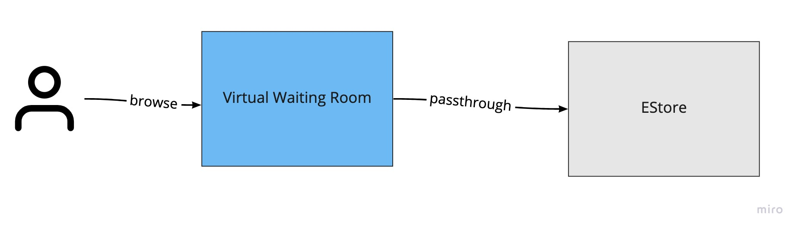

##### Container
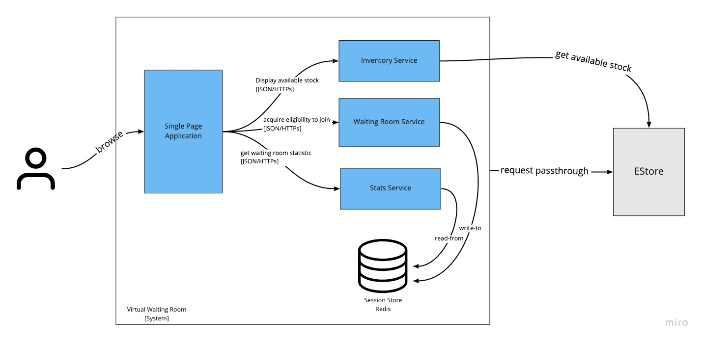

##### Component
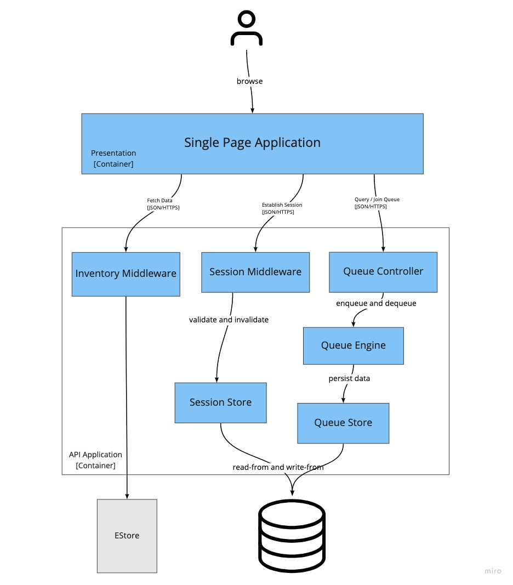

---

### 4+1
##### Use Case Scenario
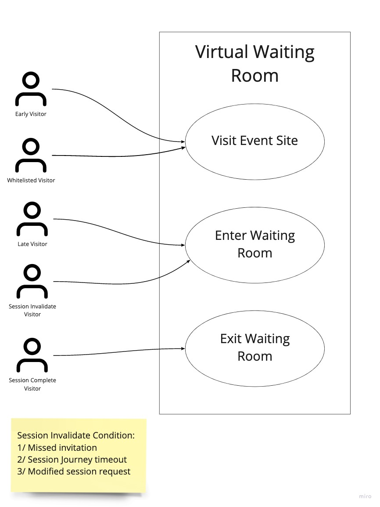

##### Deployment Option 1
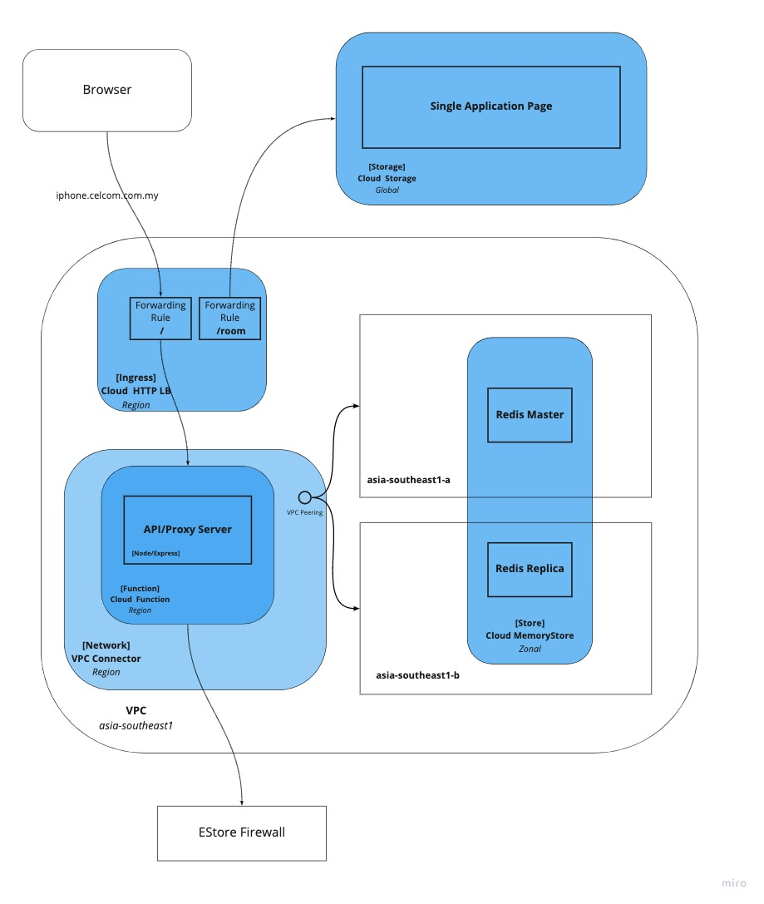

##### Deployment Option 2
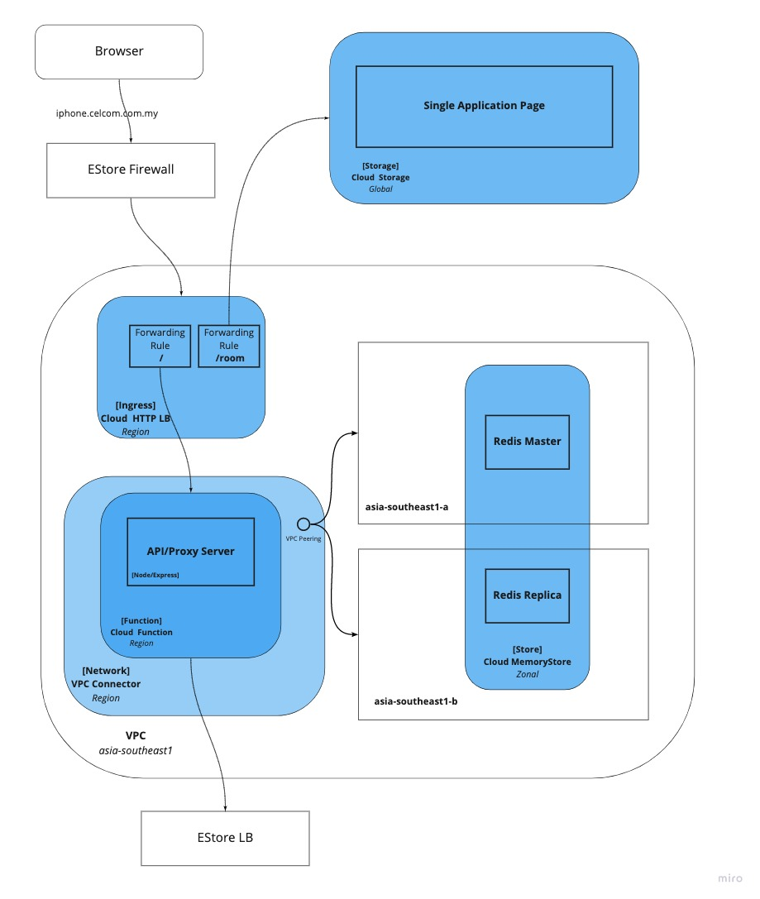

##### Deployment Trade off
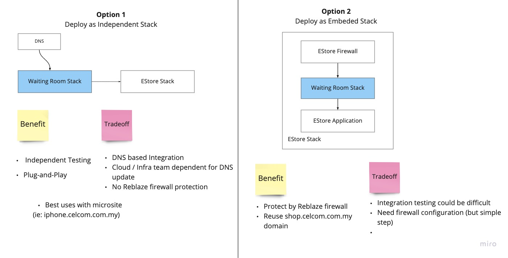

---

### Solution Design

##### What is the problem? 
#####  How it can be solved?
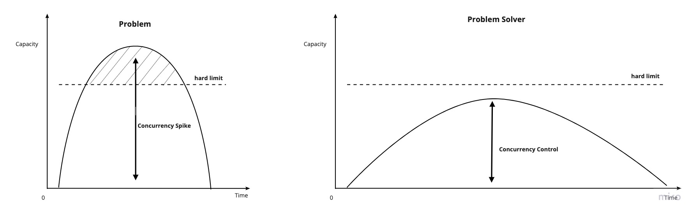

##### Algorithm
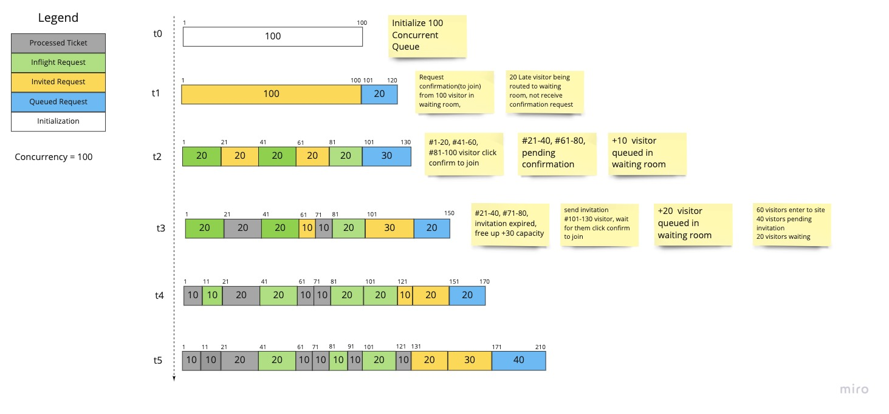

##### Class Diagram
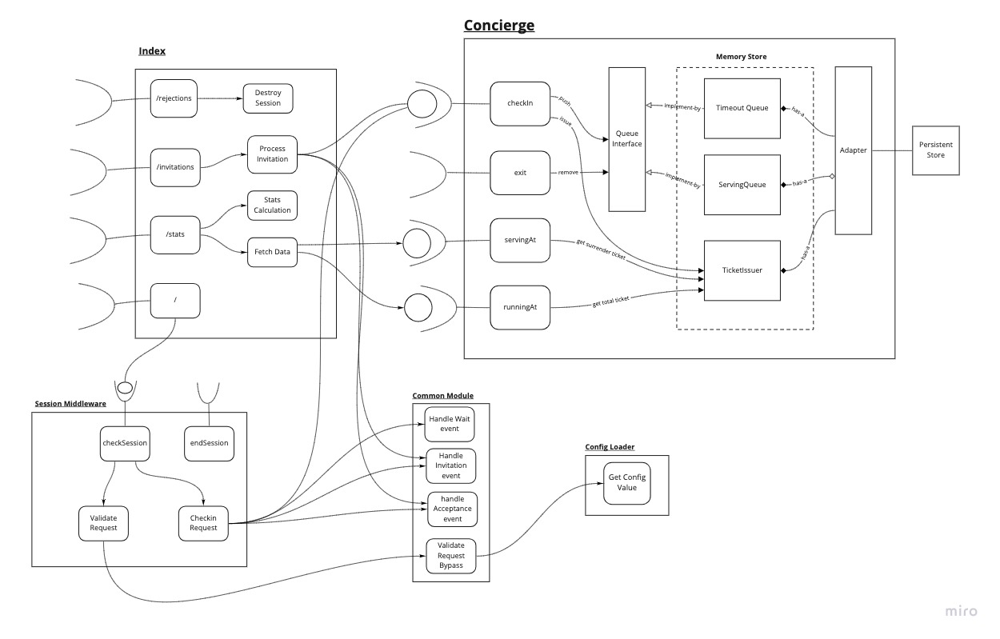

##### System Sequence - When a user fresh visit event site
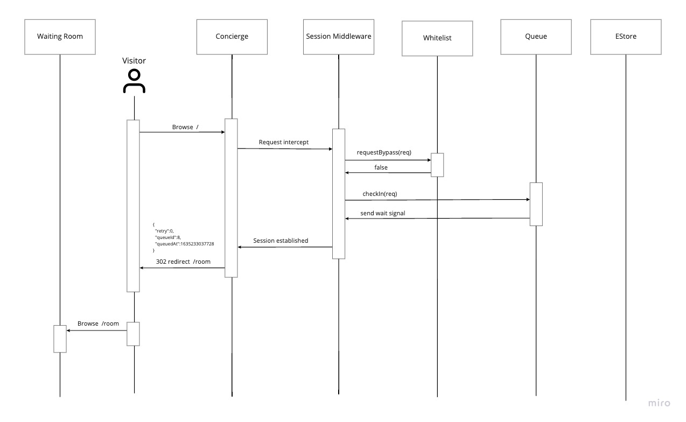

##### System Sequence - Waiting room confirmation
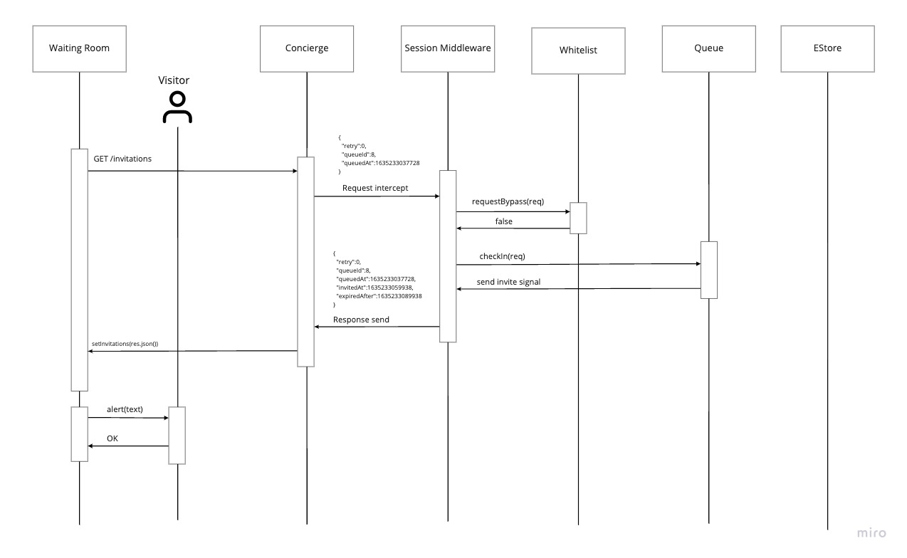

##### System Sequence - Redirect to event site
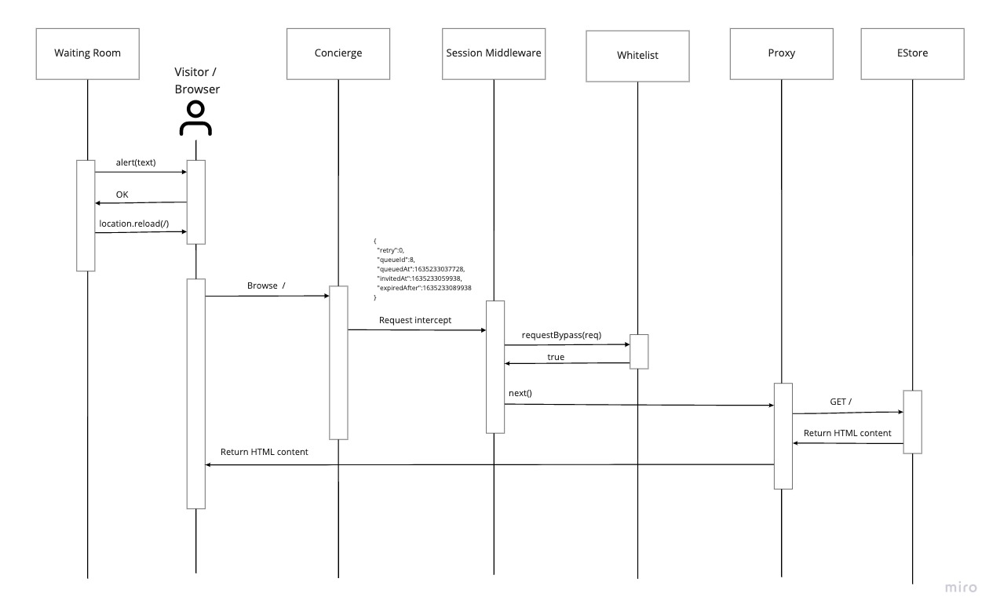

